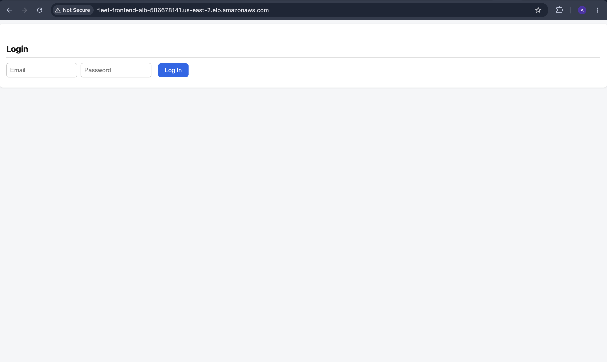
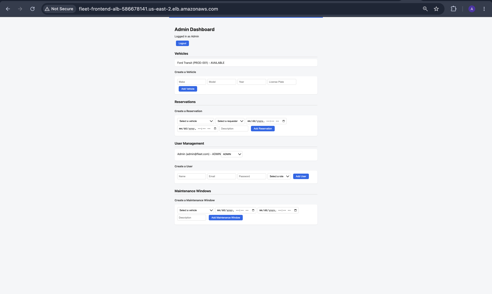
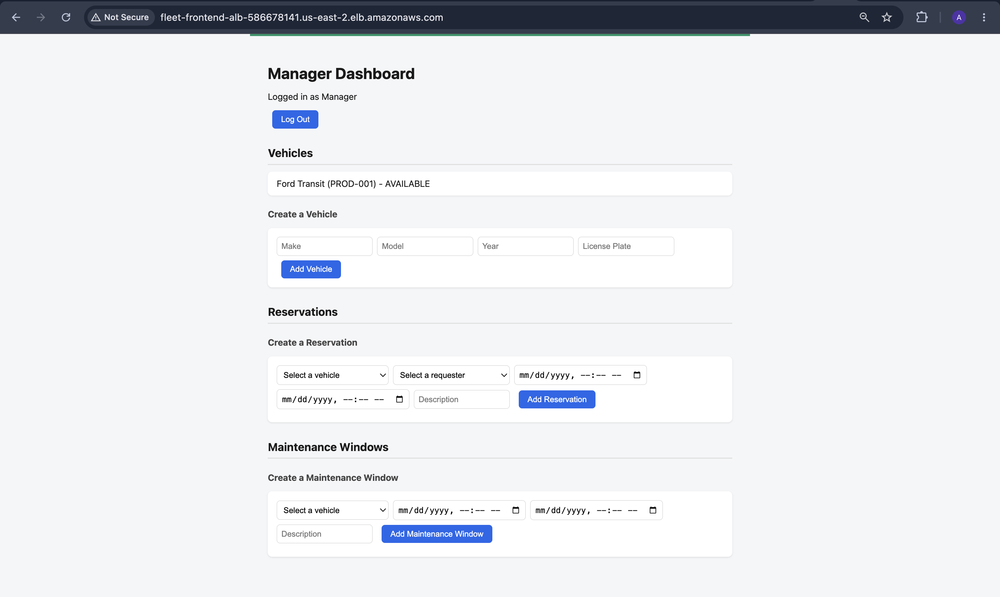
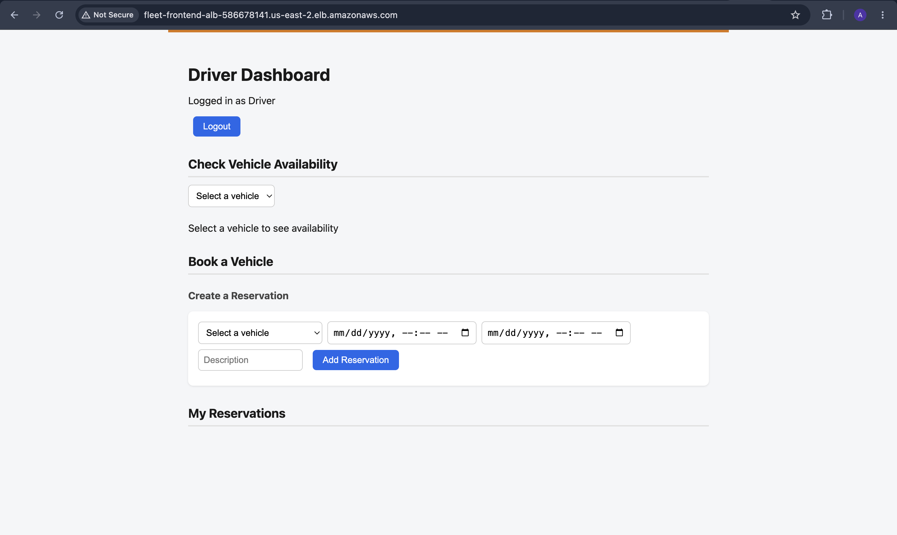
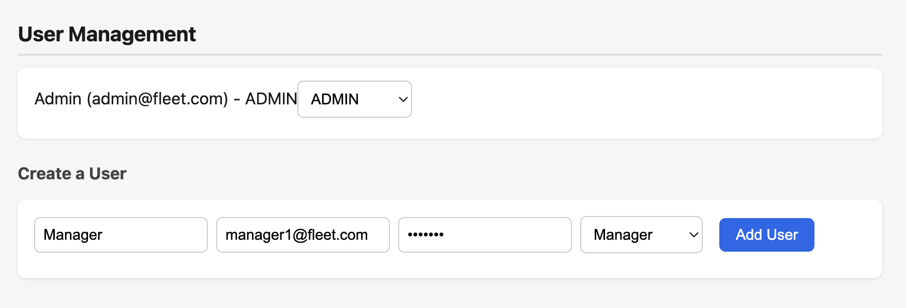
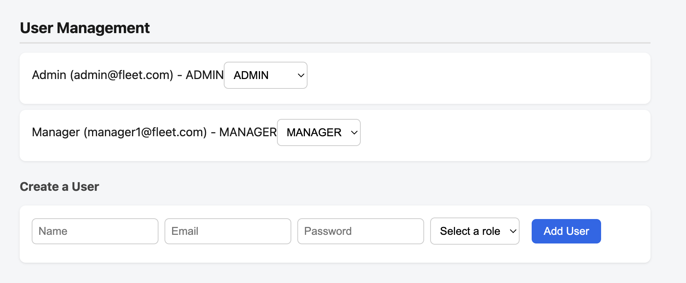

# Fleet Service

A full-stack fleet reservation and maintenance management system with role-based
access control for drivers, managers, and admins. Built as a Spring Boot backend,
deployed to AWS with a real relational schema, a two-layer permission model, and
CI/CD wired through GitHub Actions.

Frontend repo: [fleet-frontend](https://github.com/YourUsername/fleet-frontend)

Live demo: services are scaled to zero between uses to control AWS cost (see
"Deployment and cost management" below). Screenshots below reflect the live,
deployed application.

## Screenshots

**Login**



**Admin dashboard**, full access to vehicles, reservations, users, and
maintenance windows



**Manager dashboard**, same operational access as admin, minus user management



**Driver dashboard**, vehicle availability lookup and personal reservations only



**Role changes take effect immediately.** Before creating a manager account,
only the seeded admin exists:



After creating one through the admin panel, it's immediately available and its
role can be changed inline:



## Tech stack

Java 21, Spring Boot 4, Spring Security, Spring Data JPA, PostgreSQL, Maven,
Docker, Docker Compose, GitHub Actions, AWS (RDS, ECR, ECS Fargate, Application
Load Balancer).

## Architecture

Three roles, DRIVER, MANAGER, ADMIN, each with genuinely different data access,
not just hidden UI buttons. Permissions are enforced at three layers:

1. URL-level rules in `SecurityConfig`, a first-pass filter by role
2. `@PreAuthorize` on service methods, a second role gate
3. Ownership checks inside the method body where the rule depends on who's
   asking, not just what role they hold

A driver can create a reservation, but the requester is always forced to
themselves server-side, never trusted from client input. A manager or admin can
create a reservation on behalf of any driver. Editing an approved reservation
demotes it back to `PENDING`, since the underlying request changed and needs
re-approval.

`AvailabilityService` is a single, shared conflict-detection service used by
both reservations and maintenance windows, since both represent a vehicle being
unavailable for a time range. Cancellation is a soft delete, a status change to
`CANCELLED`, not a row removal, since a reservation's history matters.

## Testing

Three targeted tests, not broad CRUD coverage. Each one locks in a real
permission bug found by hand while manually testing with curl:

- A driver cannot approve their own reservation
- A manager can approve any reservation
- Editing an approved reservation demotes it back to `PENDING`

Tests use `@SpringBootTest` with `@WithMockUser` so `@PreAuthorize` checks are
genuinely exercised, not bypassed. `@Transactional` rolls back every test's
database changes automatically, so repeated runs never leave test data behind.

Three specific tests over a large generic suite was a deliberate choice. Each
one maps to a real bug that was actually found and fixed, which is a stronger
signal than broad coverage of code paths that were never actually wrong.

## Local development

```bash
docker compose up
```

Runs Postgres, the backend, and the frontend together, with a healthcheck on
Postgres so the backend doesn't attempt to connect before the database is
actually ready to accept connections.

## Deployment

Deployed on AWS: RDS for Postgres, ECR for container images, ECS Fargate
running the backend and frontend as separate services, each behind its own
Application Load Balancer.

Kubernetes was deliberately not used. Fleet Service is a cohesive monolith with
no genuine multi-service scaling need, and using Kubernetes here would have
been optimizing for a resume line rather than for what the system actually
needs. Kubernetes is a better fit for a project shaped around multiple
independently-scaling services from the start, which is planned as its own
separate, focused project.

### Real infrastructure bugs found and fixed during deployment

Four distinct, real networking and orchestration issues came up, each with a
different root cause:

**RDS security group.** The database's security group only allowed inbound
traffic from itself, not from the backend's security group. The fix was an
explicit inbound rule on RDS's security group allowing PostgreSQL traffic
specifically from the backend's security group, not from a broader source.

**ECS circuit breaker and failed rollback.** After several consecutive task
failures, ECS's deployment circuit breaker stopped retrying automatically and
attempted a rollback, which itself failed since there was no earlier working
revision to roll back to on a first deployment. Resolved by fixing the
underlying cause and manually forcing a new deployment rather than waiting on
automatic retry.

**Health check timing.** The backend takes about 40 seconds to fully start,
Spring context, Hibernate, connection pool setup. The load balancer's default
health check grace period was too short, causing ECS to kill tasks that were
still legitimately starting. Fixed by setting a 60 second health check grace
period on the service.

**ALB to container port mismatch.** The backend's security group only allowed
inbound traffic on port 80, but the container listens on port 8080. The load
balancer's connection attempts to the container were silently dropped,
producing a timeout rather than a clean rejection, which made it harder to
diagnose than an outright error would have been. Fixed with an explicit
inbound rule allowing port 8080.

### First-run admin seeding

The very first admin user can't be created through the API, since creating a
user requires already being an admin. A `CommandLineRunner` bean creates a
default admin on startup if the `users` table is empty, so any fresh
environment, including a brand-new production database, has a working admin
account without manual intervention.

## CI/CD

GitHub Actions runs the test suite and builds the Docker image on every push.
On a merge to `main`, it also pushes the built image to ECR automatically,
using a narrowly-scoped IAM user limited to ECR push permissions only, not
broad account access.

Deployment itself, scaling the ECS service up and pulling the new image, stays
a manual, deliberate action. This is a demo environment scaled to zero between
uses to control AWS cost, not a production service with continuous live
traffic, so automatic deployment on every push would either fail against a
scaled-down service or silently undo the cost control.

## Deployment and cost management

ECS services are scaled to zero desired tasks between demos. Application Load
Balancers carry an hourly cost regardless of traffic, so they're the first
thing brought down when the project isn't actively being shown.